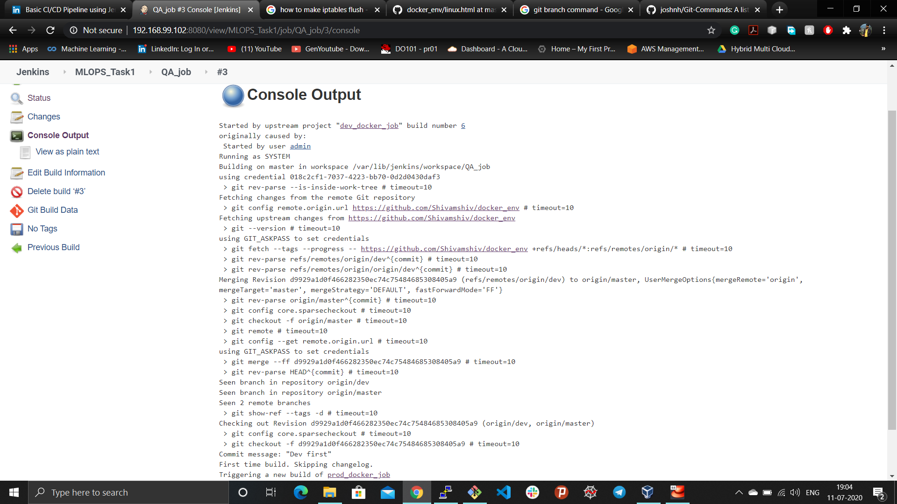

## Deployment of code in different development and production environment
In this project I deployed code, developed in different branch(master, dev) to the different docker environment(developer, production) to achieve stability for the end user.

### Prerequisite for the project:

Configure the system with docker, git and jenkins.

### Problem statement:
```
1. Job1: If Developer push to dev branch then Jenkins will fetch from dev and deploy on dev-docker environment.
2. Job2: If Developer push to master branch then Jenkins will fetch from master and deploy on master-docker environment. Both dev-docker and master-docker environment are on different docker containers.
3. Job3: Manually the QA team will check (test) for the website running in dev-docker environment. If it is running fine then Jenkins will merge the dev branch to master branch and trigger Job 2.
```
### Solution Approach:

**Job1:** Firstly, let suppose developer is developing the code and updating it in the dev branch of the Git(SCM: Source code management) repository. Then dev_docker_job in jenkins fetch the code from the dev branch of the Git repository and upload it to the local development directory in the system and it launches a separate environment to test the code.
```
sudo cp -rvf * /dev_fold
if sudo docker ps | grep dev_docker_env
then
echo "Developer environment already setup"
else
sudo docker run -dit -p 8081:80 -v /dev_fold:/usr/local/apache2/htdocs/ --name dev_docker_env httpd
fi
```
- **Job configuration done to achieve this**


**Job2:** Now, let suppose the code is previously running and accessible to the public which is updated to the master branch of the git repository. Then prod_docker_job in jenkins fetch the code from the dev branch of the Git repository and upload it to the local production directory in the system and it launches a separate environment to test the code.
```
sudo cp -rvf * /prod_fold
if sudo docker ps | grep prod_docker_env
then
echo " Production environment already setup"
else
sudo docker run -dit -p 8082:80 -v /prod_fold:/usr/local/apache2/htdocs/ --name prod_docker_env httpd
fi
```
- **Job configuration done to achieve this**


**Job3:** Now, we have two different code in diffrenetbranch with some or complete changes running in the two different environment for testing. Let, the code developed by the developer is error-free and stable. Then we can merge the code in the dev branch to the previous running code in the master branch to launch it.

- **Job configuration done to achieve this**




Now, the final pipeline of the job is-


Lastly, I want to the thanks to the Vimal Daga Sir and all the IIEC community group members who are constantly helping knowingly or unlnowlingly.
